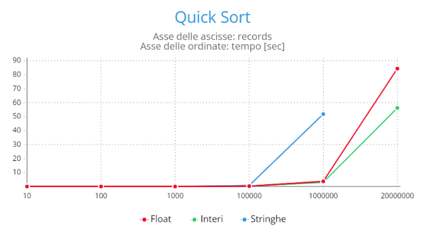
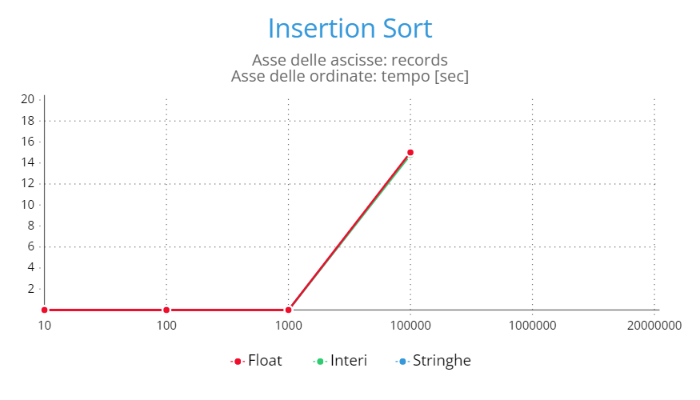

# RELAZIONE ESERCIZIO 1

## REQUISITI

Implementare una libreria che offre due algoritmi di ordinamento **Quick Sort** e **Binary Insertion Sort**. Con Binary Insertion Sort ci riferiamo a una versione dell'algoritmo Insertion Sort in cui la posizione all'interno della sezione ordinata del vettore in cui inserire l'elemento corrente è determinata tramite ricerca binaria.

Il codice che implementa Quick Sort e Binary Insertion Sort deve essere generico. Inoltre, la libreria deve permettere di specificare (cioè deve accettare in input) il criterio secondo cui ordinare i dati. Il file di test contiene 20 milioni di record da ordinare. Ogni record è descritto su una riga e contiene quattro campi: 
1. **id:** è di tipo intero ed è un identificatore univoco del record;
2. **field1:** è di tipo stringa e contiene parole estratte dalla Divina Commedia (è possibile assumere che i valori non contengano spezi o virgole);
3. **field2:** è di tipo intero;
4. **field3:** è di tipo floating point.

Usando ciascuno degli algoritmi implementati, si ordinino i record contenuti nel file record.csv in ordine non decrescente secondo i valori contenuti nei tre campi "field".

---

## IMPLEMENTAZIONE

Come consigliato dall’esempio tutoriale nella pagina del corso, abbiamo suddiviso l’implementazione in moduli, sviluppando: un *header file*, che contiene le definizioni delle funzioni, una *libreria*, che implementa le funzioni descritte nell’header e un’*applicazione* attraverso la quale leggiamo da file sorgente e assegniamo delle quadruple di valori corrispettivi per ogni record.
Le funzioni che trattano i record prendono in input oggetti di tipo generico e le funzioni con cui compararli.
La versione degli algoritmi **Quick Sort** e **Insertion Sort** è verosimilmente quella vista a lezione, ma con una diversa scelta per quello che è l’elemento perno dell’ordinamento: per il Quick Sort il pivot viene scelto in modo randomico usando come valori limite gli indici di inizio e fine dell’array da ordinare.
Una volta individuato il pivot, il valore corrispondente allo stesso indice viene scambiato con l’ultimo valore dell’array. Successivamente si procede in modo analogo a quello visto a lezione, partizionando l’array e riordinandolo.
Come da richiesta, sarà l’utente, attraverso riga di comando, a scegliere l’algoritmo di ordinamento da usare e il campo secondo cui ordinare i Record. Inoltre, deve essere necessariamente indicato anche il file sorgente da cui leggere gli elementi dei Record.

---

## DATI RACCOLTI

Durante la fase di test abbiamo usato gli algoritmi *Quick Sort* e *Insertion Sort* sui Record di soli interi con campi vuoti, con un solo elemento o con più elementi (quattro).
Successivamente siamo passati al test con il file *Records* presente nei requisiti. Eseguendo quindi i metodi su diverse sotto partizioni di tale file sono state riscontrate le misurazioni schematizzate tramite tabelle qui di seguito.

Testando dunque i vari algoritmi sui vari campi considerati, sono state trovate le seguenti tempistiche:

### **Stima tempi di ordinamento dell'algoritmo QUICK SORT:**

| Field | Numero records | Tempo di esecuzione [sec] |
|-------|----------------|--------------------|
| Stringhe | 10 | 0.000062298                 |
| Stringhe | 100 | 0.000294102                |
| Stringhe | 1000 | 0.002997034               |
| Stringhe | 100000 | 0.711722042             |
| Stringhe | 1000000 | 51.836113968           |
| Stringhe | 20000000 | > 10 minuti           |

| Field | Numero records | Tempo di esecuzione [sec] |
|-------|----------------|--------------------|
| Interi | 10 | 0.000047283                   |
| Interi | 100 | 0.000288165                  |
| Interi | 1000 | 0.002807135                 |
| Interi | 100000 | 0.260900435               |
| Interi | 1000000 | 3.004298311              |
| Interi | 20000000 | 56.235861816            |

| Field | Numero records | Tempo di esecuzione [sec] |
|-------|----------------|--------------------|
| Float | 10 | 0.000045817                    |
| Float | 100 | 0.000276994                   |
| Float | 1000 | 0.002764143                  |
| Float | 100000 | 0.265164632                |
| Float | 1000000 | 3.691210721               |
| Float | 20000000 | 84.345567835             |

### **Stima tempi di ordinamento dell'algoritmo INSERTION SORT:**

| Field | Numero records | Tempo di esecuzione [sec] |
|-------|----------------|--------------------|
| Stringhe | 10 | 0.000033385                 |
| Stringhe | 100 | 0.000083321                |
| Stringhe | 1000 | 0.002445028               |
| Stringhe | 100000 | 14.837397299            |
| Stringhe | 1000000 | > 10 minuti            |
| Stringhe | 20000000 | > 10 minuti           |

| Field | Numero records | Tempo di esecuzione [sec] |
|-------|----------------|--------------------|
| Interi | 10 | 0.000027587                   |
| Interi | 100 | 0.000066279                  |
| Interi | 1000 | 0.002287247                 |
| Interi | 100000 | 14.775654953              |
| Interi | 1000000 | > 10 minuti              |
| Interi | 20000000 | > 10 minuti             |

| Field | Numero records | Tempo di esecuzione [sec] |
|-------|----------------|--------------------|
| Float | 10 | 0.000031778                    |
| Float | 100 | 0.000072077                   |
| Float | 1000 | 0.002281447                  |
| Float | 100000 | 15.004627279               |
| Float | 1000000 | > 10 minuti               |
| Float | 20000000 | > 10 minuti              |

---

## GRAFICI

Di seguito sono riportati i grafici degli algoritmi considerati in questo esercizio.

### Grafico del Quick Sort

### Grafico dell'Insertion Sort

---

## CONCLUSIONI

Sulla base delle corrispettive complessità degli algoritmi, in particolare *[O(log n) per il Binary Insetion Sort e O((1/n)^log n) per il Quick Sort randomico]*, delle misurazioni e dei grafici sopra riportati si può arrivare a definire in maniera più accurata l'enorme vantaggio, in termini di efficienza, dell'algoritmo *Quick Sort*.

---

## COMANDI PER LA COMPILAZIONE E PER L'ESECUZIONE

***COMPILAZIONE***

Posizionarsi all'interno della cartella ***Exercise1***

Digitare:

    make all

Digitare:

    cd bin

Digitare (*esempio:* ordinamento sul field 1, utilizzando il QuickSort, sul file *100_records.csv*):

    ./app_es1 -1 quicksort 100_records.csv

**Nota:** il comando per la compilazione deve attenersi al seguente schema: *./app_es1 < -1 | -2 | -3> <quicksort | insertion_sort> <filename.csv>*

***ESECUZIONE (Test)***

Digitare (sempre all'interno della cartella *bin*):

    ./test_es1
