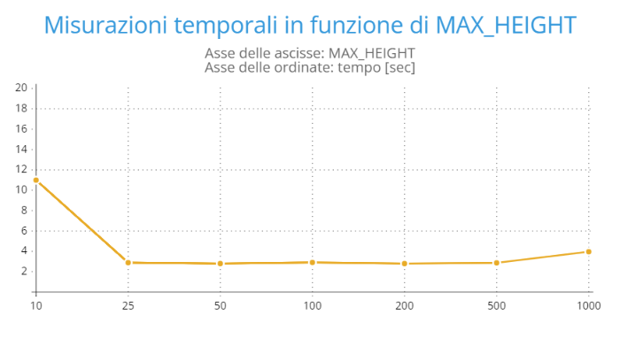

# RELAZIONE ESERCIZIO 2

## REQUISITI

Realizzare una struttura dati chiamata **skip_list**. La skip_list è un tipo di lista concatenata che memorizza una lista ordinata di elementi.

Al contrario delle liste concatenate classiche, la skip_list è una struttura dati probabilistica che permette di realizzare l’operazione di ricerca con complessità *O(log n)* in termini di tempo. Anche le operazioni di inserimento e cancellazione di elementi possono essere realizzate in tempo *O(log n)*. Per questa ragione, la skip_list è una delle strutture dati che vengono spesso utilizzate per indicizzare
dati.

Ogni nodo di una lista concatenata contiene un puntatore all’elemento successivo nella lista. Dobbiamo quindi scorrere la lista sequenzialmente per trovare un elemento nella lista. La skip_list velocizza l’operazione di ricerca creando delle “vie espresse” che permettono di saltare parte della lista durante l’operazione di ricerca. Questo è possibile perché ogni nodo della skip_list contiene non solo un singolo puntatore al prossimo elemento della lista, ma un array di puntatori che ci permettono di saltare a diversi punti seguenti nella lista. Un esempio di questo schema è rappresentato nella seguente figura: 

Si implementi quindi una libreria che realizza la struttura dati skip_list. L’implementazione deve essere generica per quanto riguarda il tipo dei dati memorizzati nella struttura.

Avendo a disposizione un dizionario (*dictionary.csv*) e un file da correggere (*correctme.csv*), le cui parole non sono tutte presenti all'interno del dizionario fornito, implementare un'applicazione che usi la struttura dati skip_list per determinare in maniera efficiente la lista di parole nel testo da correggere (*correctme.csv*) non presenti nel dizionario dato come input al programma.

---

## IMPLEMENTAZIONE

Come consigliato dall'immagine guida, abbiamo realizzato la skip_list partendo dall'allocazione della *sentinella*, che consiste in un array di puntatori ai nodi che compongono skip_list stessa. Ogni nodo avrà un proprio numero di livelli estratti casualmente tramite la funzione *randomLevel()*. Ciò permette, durante l'esecuzione, di saltare parte della lista tramite delle "vie espresse", in quanto ogni nodo contiene non solo un singolo puntatore al prossimo elemento della lista, ma un array di puntatori.

La funzione randomLevel() ha la seguente struttura:

	randomLevel()
		lvl = 1
		while random() < 0.5 and lvl < MAX_HEIGHT do
			lvl = lvl + 1
		return lvl

Il suo funzionamento può essere paragonato ,in termini probabilistici, al lancio di una moneta: la probabilità che esca testa vale 1/2 ed è equivalente alla probabilità che esca croce. Come si può vedere dallo pseudocodice della funzione randomLevel(), si comincia con un valore di lvl pari ad 1. Successivamente si tira a sorte un numero compreso tra 0 ed 1: se tale numero è minore di 0.5 e se il livello è minore di MAX_HEIGHT, allora viene incrementato lvl. Analogamente, se esce testa viene incrementato lvl, mentre se esce croce si esce e viene restituito lvl.
Ne deduciamo dunque che:

	P(1 livello) = 1/2
	P(2 livelli) = (1/2)*(1/2)
	...
	P(n livelli) = 1/(2^n)

Risulta dunque molto probabile che vi siano pochi elementi aventi il massimo numero di puntatori.
Ricordando che **MAX_HEIGHT** è una costante che definisce il massimo numero di puntatori che possono esserci in un singolo nodo della skip_list, possiamo, in generale, affermare che:
* se MAX_HEIGHT è "grande", la probabilità di avere nodi con più puntatori ai nodi successivi aumenta. Si hanno quindi più strade per accorciare il cammino della ricerca
* se MAX_HEIGHT è "piccolo", la probabilità di avere nodi con più puntatori ai nodi successivi diminuisce

Come vedremo nelle conlusioni di questa relazione, la soluzione migliore sarebbe adottare un valore per MAX_HEIGHT compreso tra 25 e 100. 

---

## DATI RACCOLTI

Durante lo sviluppo della struttura abbiamo adottato diverse misure per ciò che riguarda la dimensione della macro MAX_HEIGHT, registrando le seguenti tempistiche:

| MAX_HEIGHT | Tempo di esecuzione [sec] |
|------------|--------------------------------|
|      10 | 10.997472819    |
|      25 | 2.885840471     |
|      50 | 2.801010169     |
|     100 | 2.904223341     |
|     200 | 2.798549896     |
|     500 | 2.867968617     |
|    1000 | 3.961041298     |

---

## GRAFICI

Di seguito è riportato il grafico dell'algoritmo considerato in questo esercizio.

### Grafico della skip_list

---

## CONCLUSIONI

La scelta di valori grandi della macro MAX_HEIGHT non comporta benefici in termini di tempo per l'algoritmo, tuttavia anche l'assunzione di un valore eccessivamente basso comporta dei tempi di inserimento e ricerca eccessivamente lunghi.
La soluzione migliore sarebbe adottare un valore per MAX_HEIGHT compreso tra 25 e 100.

---

## COMANDI PER LA COMPILAZIONE E PER L'ESECUZIONE

***COMPILAZIONE***

Posizionarsi all'interno della cartella ***Exercise2***

Digitare:

    make all

Digitare:

    cd bin

Digitare:

    ./app_es2 dictionary.txt correctme.txt

***ESECUZIONE (Test)***

Digitare (sempre all'interno della cartella *bin*):

    ./test_es2
